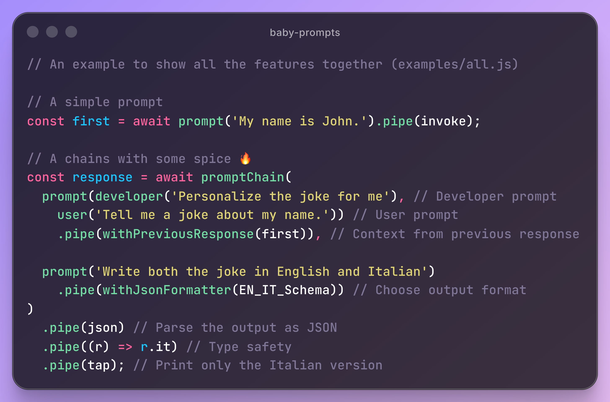

# Baby Prompts

[](https://www.npmjs.org/package/baby-prompts)
[](https://npmcharts.com/compare/baby-prompts?minimal=true)

A NodeJS library providing super basic prompt techniques and chains for OpenAI's response API.

- [Baby Prompts](#baby-prompts)
  - [Overview](#overview)
  - [Installation](#installation)
  - [Prompt techniques examples](#prompt-techniques-examples)
    - [1. Zero-shot prompting](#1-zero-shot-prompting)
    - [2. Few-shot prompting](#2-few-shot-prompting)
    - [3. Prompt chaining](#3-prompt-chaining)
  - [Streaming](#streaming)
  - [Structured output](#structured-output)
  - [Conversational history](#conversational-history)
  - [Notes for version 2.2.x](#notes-for-version-22x)
  - [Credits](#credits)



## Overview

👉 _Baby Prompts_ is a NodeJS library that allows you to easily create different prompt techniques (see [below](#prompt-techniques-examples)) and choose formatting output. It also supports streaming and conversational history.

A full list of examples is available [here](examples).

## Installation

Install the library by typing

```sh
npm install baby-prompts
```

To run the examples, you also need to have an account with [OpenAI](https://platform.openai.com) and sufficient credits in your account to run the models.

You then need to create a `.env` file with the variable `OPENAI_API_KEY` set to your own OpenAI API key and have that in your root folder. You can find an API key [here](https://platform.openai.com/api-keys).

> ⚠️ This is a library for NodeJS and relies on having a .env file with the OPEN_API_KEY in it. It won't work directly from the browser.

## Prompt techniques examples

Before you can invoke any prompt, you need to configure your prompt by choosing a model.

```js
// Import the necessary features
import {
  getPrompt,
  promptChain,
  invoke,
  outputText,
  user,
  assistant,
  developer,
  tap,
  json,
  withJsonFormatter,
  withPreviousResponse,
} from 'baby-prompts';

// Get the prompt function with default settings
const prompt = getPrompt();

// ...or select custom options
const prompt = getPrompt({
  model: 'gpt-5',
  reasoning: { effort: 'low' },
  stream: false,
});
```

The default model is `gpt-4.1-mini`.

Follow the [OpenAI documentation](https://platform.openai.com/docs/api-reference/introduction) for choosing models and options.

Here are some examples of how to use different prompting techniques:

- _Zero-shot_ prompting
- _Few-shot_ prompting
- Prompt _chains_

### 1. Zero-shot prompting

Here is a simple example of invoking a prompt.

```js
prompt(developer('Be a funny assistant'), 'Tell me a joke') // setup the prompt
  .pipe(invoke) // execute it
  .pipe(outputText) // extract the output_text from the response
  .pipe(tap); // print it
```

Note that the `pipe` method is basically a `then` call (i.e., method of a Promise).
If you prefer to _async/await_, here is the same code.

```js
const result = await invoke(
  prompt(developer('Be a funny assistant'), 'Tell me a joke')
);
console.log(outputText(result)); // or result.output_text
```

You can find a full working example [here](./examples/zero_shot.js).

### 2. Few-shot prompting

Multiple messages can be combined before invocation, and you can choose the `user` (default), `developer`, or `assistant` roles. Note that this is still a single prompt (a single _invoke_ method is called).

```js
prompt(
  developer('Ask a question following this style'),
  user('How are you?'),
  assistant('How are you, human?'),
  user('What time is it?'),
  assistant('What time is it, human?'),
  user('Where are you from?'),
  assistant('Where are you from, human?'),
  user('What is your age?') // expected: "What is your age, human?"
)
  .pipe(invoke)
  .pipe(outputText)
  .pipe(console.log);
```

You can find a full working example [here](./examples/few_shot.js).

### 3. Prompt chaining

With prompt chaining, you can chain the output of a prompt directly into the input of the next one.

```js
promptChain(
  prompt(user('What is 1+1?')),
  prompt(user('Say that without using numbers.')),
  prompt(user('Add an emoji at the end.'))
)
  .pipe(outputText)
  .pipe(console.log);
```

Please note that when using chains, you do not need to call the _invoke_ method manually, as it is called for you by the _promptChain_ function.

For more complex examples, involving the usage of the `tap` function and formatted output, look at [this](./examples/chain.js).

## Streaming

When you create a prompt at first you can pass the `stream: true` option to enable streaming.

```js
const stream = await prompt(user('Write a paragraph about the ocean'))
  .pipe(withOptions({ stream: true })) // require to have a streamed response
  .pipe(invoke);

for await (const event of stream) {
  if (event.type == 'response.output_text.delta')
    process.stdout.write(event.delta);
}
```

This is an [example](./examples/stream.js).

## Structured output

You can structure the output of a prompt just before invocation. For that, you need to use the [zod](https://www.npmjs.com/package/zod) library, which is already included as a dependency.

```js
import { z } from 'zod';

const Person = z.object({
  name: z.string(),
  age: z.number(),
});

const PeopleList = z.object({
  people: z.array(Person).length(10), // exactly 10 people
});

// prompt
prompt(
  developer('You are a helpful assistant'), //
  'Write a list of 10 people with name and age'
)
  .pipe(withJsonFormatter(PeopleList)) // format the output
  .pipe(invoke)
  .pipe(json)
  .pipe(console.log);
```

[Here](./examples/structured_output.js) a full working example.

## Conversational history

You can preserve information across multiple messages or turns in a conversation by passing a response as an input to the next prompt using the `withPreviousResponse` function.

Here a couple of examples.

```js
// Get the first prompt
const res = await prompt('My name is Jon Snow.').pipe(invoke);

// Using a single prompt
prompt('What is my name?')
  .then(withPreviousResponse(res)) // pass in the previous response
  .then(invoke)
  .then(outputText)
  .then(console.log); // "Jon Snow"

// Using a chain
promptChain(
  prompt('What is my name?').then(withPreviousResponse(res)), // pass in the previous response
  prompt('Add an emoji to my name.')
)
  .then(outputText)
  .then(console.log); // "Jon Snow 🐺"
```

Here the [full example](./examples/conversation.js).

## Notes for version 2.2.x

There a few breaking changes from version 2.2.x onward.

The function `getPrompt` now only takes as parameter the default options to tweak the model.

The function `jsonFormatter` has been renamed to `withJsonFormatter` for consistency with other similar functions.

## Credits

Developed by [MAKinteract](https://make.kaist.ac.kr/andrea) with ♥️.
